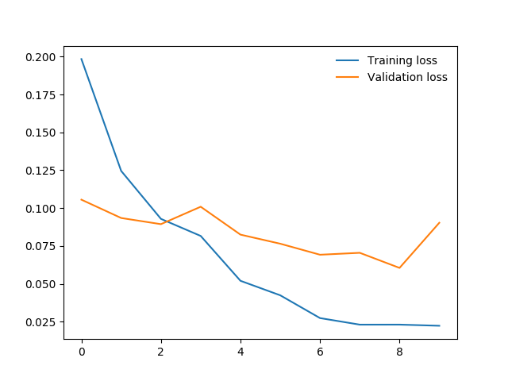
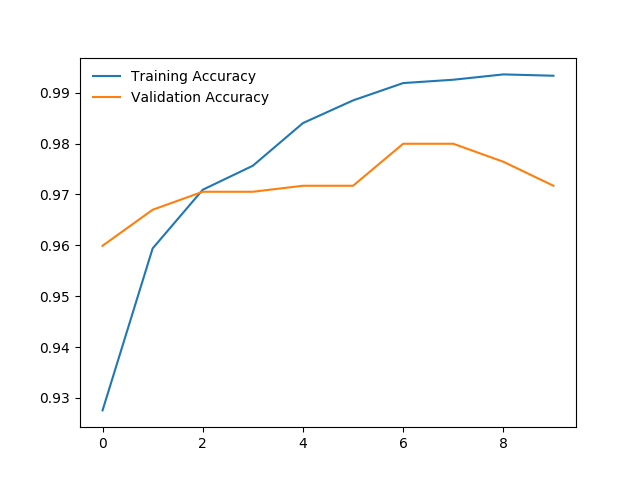
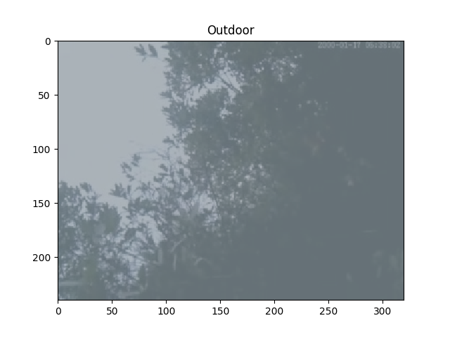

# pex-image-classifier
Transfer Learning for coding challenge by Pex.

1. Generate data using generate_data.py:
    
    ``
    python3 generate_data.py [path-to-images] [path-to-data-dump] [extension]
    ``
    
    Example:
    ``
     python3 generate_data.py Pex-ML-Challenge/cleaned_data Pex-ML-Challenge/ jpg
    ``

2. Train using Transfer Learning over pre-trained ResNet-18 Model

    Find the trained model here: https://drive.google.com/file/d/1b7wzeyPdzLU09mhqrSVpCMkjw4gp2JRc/view?usp=sharing
    
    
        Epoch 0/9
        ----------
        train Loss: 0.1984 Acc: 0.9276
        dev Loss: 0.1056 Acc: 0.9599

        Epoch 1/9
        ----------
        train Loss: 0.1246 Acc: 0.9594
        dev Loss: 0.0935 Acc: 0.9670

        Epoch 2/9
        ----------
        train Loss: 0.0929 Acc: 0.9709
        dev Loss: 0.0894 Acc: 0.9705

        Epoch 3/9
        ----------
        train Loss: 0.0816 Acc: 0.9756
        dev Loss: 0.1009 Acc: 0.9705

        Epoch 4/9
        ----------
        train Loss: 0.0520 Acc: 0.9840
        dev Loss: 0.0825 Acc: 0.9717

        Epoch 5/9
        ----------
        train Loss: 0.0425 Acc: 0.9885
        dev Loss: 0.0765 Acc: 0.9717

        Epoch 6/9
        ----------
        train Loss: 0.0274 Acc: 0.9919
        dev Loss: 0.0692 Acc: 0.9800

        Epoch 7/9
        ----------
        train Loss: 0.0231 Acc: 0.9925
        dev Loss: 0.0705 Acc: 0.9800

        Epoch 8/9
        ----------
        train Loss: 0.0231 Acc: 0.9936
        dev Loss: 0.0605 Acc: 0.9764

        Epoch 9/9
        ----------
        train Loss: 0.0224 Acc: 0.9933
        dev Loss: 0.0903 Acc: 0.9717

        Training complete in 3m 40s
        Best dev Acc: 0.979953
    ``

    Training/Validation Loss vs Epochs Curves:
    

    Training/Validation Accuracy vs Epochs Curves:
    

3. Inference using inference.py:
    ``
    python3 inference.py [model-path] [test_image_path]
    ``

    Example:
    ``
    python3 inference.py pex-challenge-model.pyt test_image.jpg
    ``
    
    Output:
    

    

